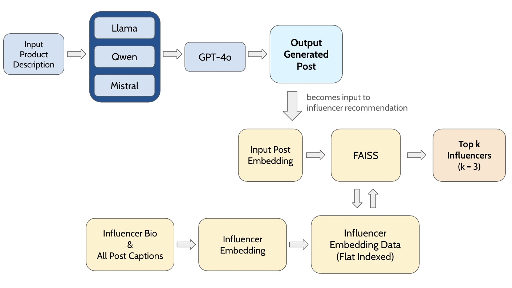

# InstaAIModel: Automating Ad-Content Generation and Influencer Selection for Instagram Marketing

## Project Overview
This project automates 2 core tasks in Instagram influencer marketing:
1. Post Generation - Uses instruction-tuned LLMs to generate realistic, influencer-style sponsored posts from product descriptions.
2. Influencer Recommendation - Identifies the top-k influencers whose style aligns best with a given product post using SBERT embeddings and FAISS similarity search.

Our pipeline uses GPT-4o to synthesize outputs from LLaMA-3.1-8B-Instruct, Qwen2.5-7B-Instruct, and Mistral-7B-Instruct-v0.3 for post generation. SBERT and FAISS are utilized are influencer retrieval. Evaluation was conducted using both GPT-o1 as a judge model and human evaluation. We intend this approach to be a scalable solution for social media marketing automation.



## Setup
### 1. Clone the Repository
```sh
git clone https://github.com/hjjyhj/InstaAIModel.git
cd InstaAIModel
```
**Important**: Clone into your home directory, not the shared directory mentioned below.

### 2. Conda Environment
Miniconda3 installed. You can make that conda environment as default by
```sh
cd /scratch/eecs487w25_class_root/eecs487w25_class/shared_data/johnkimm_dir/
export PATH="/scratch/eecs487w25_class_root/eecs487w25_class/shared_data/johnkimm_dir/miniconda3/bin:$PATH"
source ~/.bashrc
```
Check with 
```sh
which conda
```
This should show the path within `johnkimm_dir/miniconda3`.
Note that is where all the data that we need will be shared. 

You can activate the conda environment by 
```sh
conda activate my_env
```
Make sure to activate `my_env`, since all the dependencies are already downloaded there.

### 3. Install Required Packages
```sh
cd /home/<your_directory>/InstaAIModel
pip install -r requirements.txt
```

### Important Note: Shared Data Deletion
Everything in the shared directory `/scratch/eecs487w25_class_root/eecs487w25_class/shared_data` will be deleted in 60 days if the files were not used.
Make sure to save files that you need to your home directory.


## Directory Structure

| Folder  | Description |
| ------------- | ------------- |
| model_download_train  | Contains scripts for downloading, checking, and fine-tuning the language models (LLaMA, Qwen, and Mistral)  |
| post_generation  | Handles the generation and evaluation of Instagram-style posts using the trained models. Includes prompt inputs, raw and refined outputs, and scripts for running and comparing generations.  |
| run_models  | Implements the influencer recommendation pipeline. It generates SBERT embeddings for influencer profiles, builds FAISS indexes, and retrieves top-k influencers based on similarity to generated posts.  |


## Run the Post Generation
```sh
cd /home/<your_directory>/InstaAIModel/post_generation
python run_post_generation.py
```
- This script reads input products from `all_input_product_desc.json`
- Outputs from each model are saved to `smaller_models_output.json` or `untuned_output.json`, depending on whether we are prompting the fine-tuned or untuned version
- Users can change input product descriptions
- Optional GPT-4o synthesizing can be enabled at the end of the script

## Run the Influencer Recommendation
```sh
cd /home/<your_directory>/InstaAIModel/recommend_influencer
python run_FAISS.py
```
- Loads a previously-built FAISS index and influencer embeddings
- Encodes a sample post using SBERT (`all-MiniLM-L12-v2`)
- Returns the top k most semantically similar influencer names
- Users can edit the `query_text` to try different inputs

## Dataset
### Influencer and Brand Dataset: Sponsorship Detection
- Collected by Professor Seungbae Kim (University of South Florida)
- 1.6 M Instagram posts that mention 26,910 brand names and were published by 38,113 influencers
- [Link to Request the Dataset](https://sites.google.com/site/sbkimcv/dataset/instagram-influencer-dataset?authuser=0)

We used the full dataset for training, as tasks like post generation and influencer recommendation do not have a single correct output. The dataset was split into three equal parts to fine-tune each smaller language model (Llama, Qwen, Mistral) individually, allowing them to learn diverse influencer styles. For post generation, the feature used in training was post caption. For influencer recommendation, we used influencer usernames and bios.

## Our Team
- Ho Jung Kim
- Hannah Sun
- Xinyi Li
- Amira Said